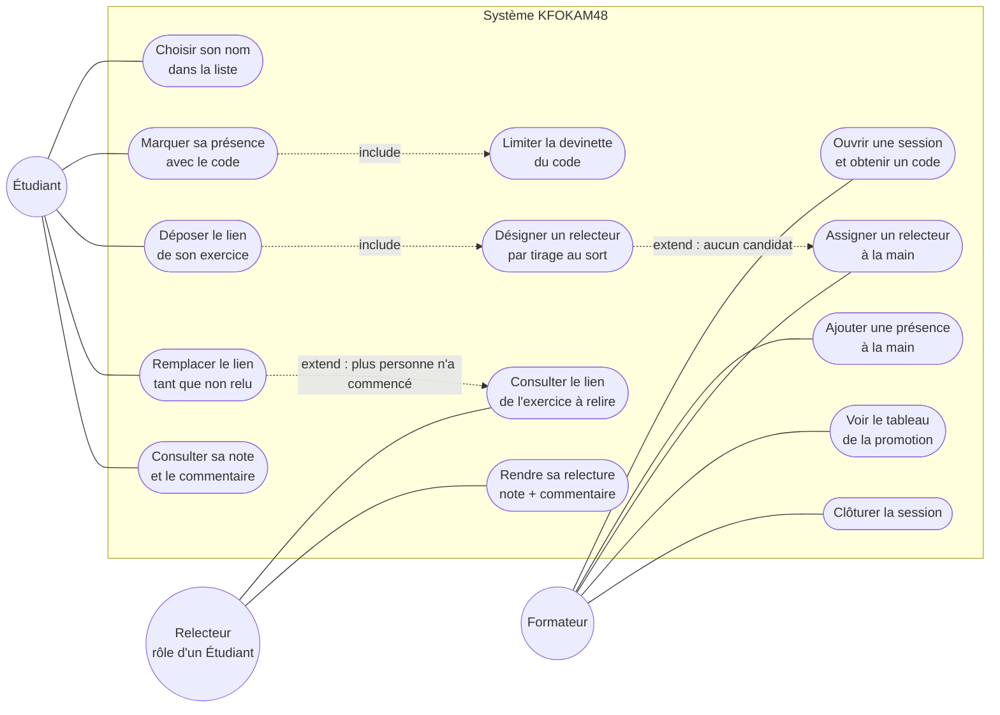

# D1 — Diagramme de cas d'utilisation

**Version** : 1.0 (étape 1) · **Source** : `docs/CAHIER_DES_CHARGES.md` (§2, §3, §4)

Mermaid n'ayant pas de type natif « cas d'utilisation », le diagramme est exprimé en
`flowchart` : les acteurs sont des nœuds ronds, les cas d'utilisation des nœuds
stadium, et le trait plein matérialise l'association acteur ↔ cas d'utilisation.

Rappel de modélisation : **Relecteur n'est pas un acteur distinct**, c'est un rôle tenu
par un Étudiant désigné par tirage au sort (Q7). Le formateur n'apparaît pas comme
relecteur : c'est une décision explicite de la section 7.

## Légende des relations

| Relation | Signification | Règle |
|---|---|---|
| `include` | Toujours déclenché avec le cas de base | RG5 (limitation des tentatives accompagne toute saisie de code), RG9 (le tirage est déclenché par le dépôt) |
| `extend` | Se produit seulement sous condition | RG10 (aucun candidat éligible → assignation manuelle), RG16 (lien figé dès la première consultation) |

## Traçabilité des cas d'utilisation

| Cas | Exigence | Opération du contrat |
|---|---|---|
| Ouvrir une session et obtenir un code | EF1 | `POST /api/sessions` |
| Marquer sa présence | EF2, EF3 | `POST /api/presences` |
| Ajouter une présence à la main | EF4 | `POST /api/sessions/{id}/presences` |
| Choisir son nom dans la liste | EF15 | `GET /api/promotions/{id}/etudiants` |
| Déposer le lien de son exercice | EF5 | `POST /api/exercices` |
| Remplacer le lien | EF6 | `PUT /api/exercices/{id}` |
| Désigner un relecteur par tirage | EF7 | inclus dans `POST /api/exercices` |
| Assigner un relecteur à la main | EF8 | `POST /api/exercices/{id}/relecteur` |
| Consulter le lien à relire | EF9 | `GET /api/relectures/{id}` |
| Rendre sa relecture | EF10 | `POST /api/relectures/{id}` |
| Consulter sa note et le commentaire | EF11 | `GET /api/etudiants/{id}/exercices` |
| Voir le tableau de la promotion | EF12 | `GET /api/tableau` |
| Clôturer la session | EF14 | `POST /api/sessions/{id}/cloture` |
| Limiter la devinette du code | EF13 | transverse à `POST /api/presences` |
