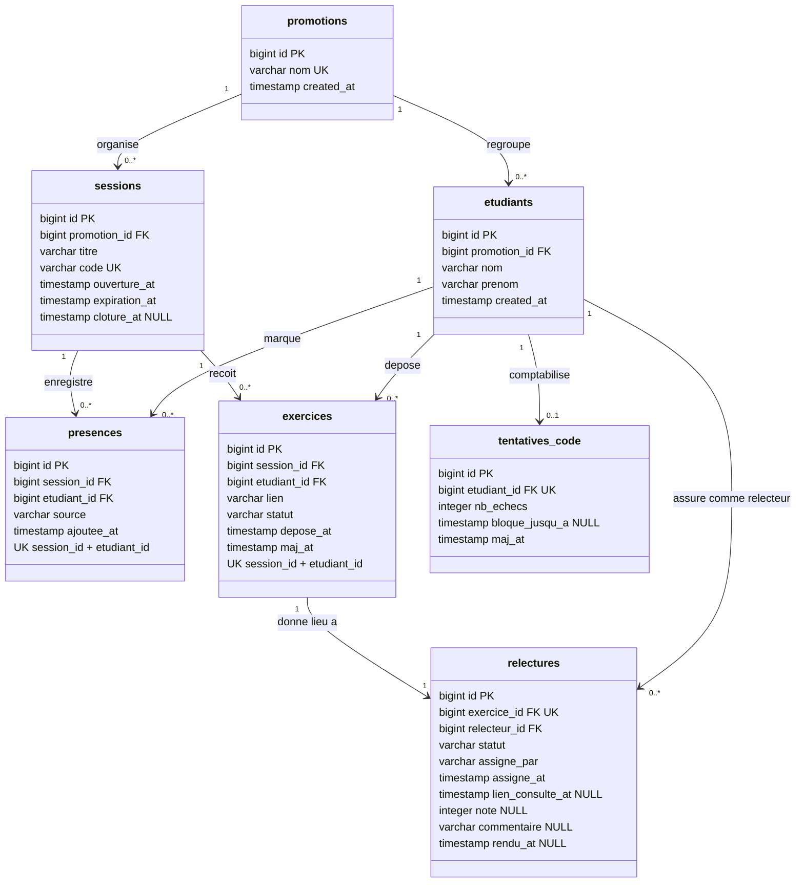

# D2 — Modèle de données (diagramme de classes)

**Version** : 1.0 (étape 1) · **Source** : `docs/CAHIER_DES_CHARGES.md` (§6, §7)

## Portée et engagement

Ce diagramme est **normatif pour la persistance** : les 7 tables listées ci-dessous sont
exactement celles que Flyway créera à l'étape 2, avec leurs colonnes, contraintes
d'unicité et clés étrangères. Aucune table supplémentaire n'est prévue à ce stade ;
toute évolution ultérieure passera par un nouveau script de migration, jamais par une
modification de `V1`.

**Hypothèse de nommage** : noms de tables et de colonnes en minuscules, au pluriel pour les
tables, identifiants `id` en `BIGINT` auto-incrémenté (identité), horodatages en UTC.

## Diagramme

## Détail des tables et justification de chaque choix

### 1. `promotions`

| Colonne | Type | Contrainte | Rôle |
|---|---|---|---|
| `id` | BIGINT | PK, auto | Identifiant utilisé par `promotionId` (`POST /api/sessions`, `GET /api/tableau`) |
| `nom` | VARCHAR(120) | NOT NULL, UNIQUE | Libellé affiché |
| `created_at` | TIMESTAMP | NOT NULL | Traçabilité |

Justification : le contrat impose `promotionId` en entrée et une erreur
`404 promotion inconnue` en sortie. La promotion doit donc exister en base ; elle est
alimentée par une migration de données de référence (T6, §7.6).

### 2. `etudiants`

| Colonne | Type | Contrainte | Rôle |
|---|---|---|---|
| `id` | BIGINT | PK, auto | `etudiantId` du contrat |
| `promotion_id` | BIGINT | FK → `promotions.id`, NOT NULL | Portée de la liste de noms (Q1) et contrôle RG19 |
| `nom` | VARCHAR(80) | NOT NULL | Affichage et tri de la liste (EF15) |
| `prenom` | VARCHAR(80) | NOT NULL | Affichage |
| `created_at` | TIMESTAMP | NOT NULL | Traçabilité |

Justification : Q1 impose une liste de noms sans mot de passe ; aucune colonne
d'authentification n'est créée, ce qui matérialise l'hypothèse H1 (§7.7). La clé étrangère
vers la promotion permet de refuser un dépôt ou une présence hors promotion (RG19).

### 3. `sessions`

| Colonne | Type | Contrainte | Rôle |
|---|---|---|---|
| `id` | BIGINT | PK, auto | `id` renvoyé par `POST /api/sessions` |
| `promotion_id` | BIGINT | FK → `promotions.id`, NOT NULL | Périmètre du tableau (Q16) |
| `titre` | VARCHAR(160) | NOT NULL | Champ obligatoire du contrat (`400 CHAMP_MANQUANT`) |
| `code` | VARCHAR(6) | NOT NULL, UNIQUE | Code de présence dicté (Q1, RG1) |
| `ouverture_at` | TIMESTAMP | NOT NULL | Base de l'expiration (Q2) |
| `expiration_at` | TIMESTAMP | NOT NULL | `ouverture_at + 15 min` ; **fin des présences** (Q2, Q3, §7.5) |
| `cloture_at` | TIMESTAMP | NULL | Nul tant que le formateur n'a pas clôturé (Q12) ; **fin des dépôts** |

Justification : ces deux derniers horodatages distincts sont la traduction directe de la
décision §7.5 — un seul jalon ne permettrait pas de satisfaire Q3 (présence refusée après
expiration) et Q12 (dépôt encore possible). L'unicité de `code` matérialise RG1 : deux
sessions ouvertes simultanément ne peuvent pas partager un code.

### 4. `presences`

| Colonne | Type | Contrainte | Rôle |
|---|---|---|---|
| `id` | BIGINT | PK, auto | `id` renvoyé par `POST /api/presences` |
| `session_id` | BIGINT | FK → `sessions.id`, NOT NULL | Session concernée |
| `etudiant_id` | BIGINT | FK → `etudiants.id`, NOT NULL | Étudiant présent |
| `source` | VARCHAR(10) | NOT NULL, CHECK ∈ {`ETUDIANT`, `FORMATEUR`} | Origine de la saisie (Q14, RG17) |
| `ajoutee_at` | TIMESTAMP | NOT NULL | Traçabilité |
| — | — | **UNIQUE (`session_id`, `etudiant_id`)** | Unicité de présence (RG4) |

Justification : l'unicité est portée par la base et non par un simple test applicatif, afin
que le `409 DEJA_PRESENT` du contrat reste vrai même en cas de double clic simultané
(RG4). Le champ `source` est une information d'affichage : il **ne filtre pas**
l'éligibilité au tirage (décision §7.2).

### 5. `exercices`

| Colonne | Type | Contrainte | Rôle |
|---|---|---|---|
| `id` | BIGINT | PK, auto | `id` renvoyé par `POST /api/exercices` |
| `session_id` | BIGINT | FK → `sessions.id`, NOT NULL | Session du dépôt |
| `etudiant_id` | BIGINT | FK → `etudiants.id`, NOT NULL | Auteur |
| `lien` | VARCHAR(500) | NOT NULL | URL déposée (RG22) |
| `statut` | VARCHAR(20) | NOT NULL, CHECK ∈ {`DEPOSE`, `EN_ATTENTE`, `SANS_RELECTEUR`, `RELU`} | Cycle de vie (D4) |
| `depose_at` | TIMESTAMP | NOT NULL | Traçabilité |
| `maj_at` | TIMESTAMP | NOT NULL | Dernière modification, notamment le remplacement de lien (Q13) |
| — | — | **UNIQUE (`session_id`, `etudiant_id`)** | Un étudiant = un exercice par session (`409 EXERCICE_DEJA_DEPOSE`) |

Justification : l'unicité traduit directement l'erreur `409 exercice déjà déposé` du
contrat. Le statut `DEPOSE` n'existe que le temps de la transaction de dépôt : dès que le
tirage a eu lieu, il devient `EN_ATTENTE` ou `SANS_RELECTEUR` (RG9, RG10). Le statut
`RELU` est terminal (RG12). L'état « relecture commencée » n'est **pas** un statut : il est
déduit de `relectures.lien_consulte_at`, ce qui évite de multiplier les états (RG16).

### 6. `relectures`

| Colonne | Type | Contrainte | Rôle |
|---|---|---|---|
| `id` | BIGINT | PK, auto | `{id}` de `POST /api/relectures/{id}` |
| `exercice_id` | BIGINT | FK → `exercices.id`, **UNIQUE**, NOT NULL | Un seul relecteur par exercice (Q6, RG7) |
| `relecteur_id` | BIGINT | FK → `etudiants.id`, NOT NULL | Relecteur tiré ou assigné |
| `statut` | VARCHAR(20) | NOT NULL, CHECK ∈ {`EN_ATTENTE`, `RENDUE`} | Relecture rendue ou non (Q11) |
| `assigne_par` | VARCHAR(10) | NOT NULL, CHECK ∈ {`SYSTEME`, `FORMATEUR`} | Trace du tirage automatique ou de l'assignation manuelle (§7.4) |
| `assigne_at` | TIMESTAMP | NOT NULL | Date du tirage ou de l'assignation |
| `lien_consulte_at` | TIMESTAMP | NULL | Première consultation du lien : fige le remplacement (Q13, T8) |
| `note` | INTEGER | NULL, CHECK 0–20 | Nulle tant que la relecture n'est pas rendue (Q9) |
| `commentaire` | VARCHAR(2000) | NULL | Commentaire du relecteur (Q8) |
| `rendu_at` | TIMESTAMP | NULL | Date d'envoi ; **non nulle = note définitive** (Q15, RG12) |

Justification : `UNIQUE(exercice_id)` est la garantie structurelle de Q6. Les colonnes
`note`, `commentaire` et `rendu_at` étant nullables, la base ne peut pas contenir une note
« rendue » sans horodatage ni une note « en attente » avec une valeur, ce qui rend
l'invariant de Q15 vérifiable par une simple contrainte. `assigne_par` conserve la raison
d'être de la relecture et rend le déblocage manuel du §7.4 auditable. Aucune colonne ne
permet de réécrire une note : la décision §7.1 interdit toute correction, l'absence de
mécanisme est donc volontaire.

### 7. `tentatives_code`

| Colonne | Type | Contrainte | Rôle |
|---|---|---|---|
| `id` | BIGINT | PK, auto | — |
| `etudiant_id` | BIGINT | FK → `etudiants.id`, **UNIQUE**, NOT NULL | Une ligne de compteur par étudiant (Q4, H7) |
| `nb_echecs` | INTEGER | NOT NULL, défaut 0 | Nombre d'échecs consécutifs |
| `bloque_jusqu_a` | TIMESTAMP | NULL | Fin du blocage de 2 minutes (Q4, RG5) |
| `maj_at` | TIMESTAMP | NOT NULL | Dernière tentative |

Justification : Q4 exige un blocage temporaire après cinq échecs. Le compteur est porté par
l'étudiant et non par la session (hypothèse H7), conformément à la formulation « bloquez-le
deux minutes » ; la colonne `bloque_jusqu_a` évite toute tâche planifiée, le déblocage
étant calculé à la lecture (RG5 → `429 TROP_DE_TENTATIVES`).

## Tables volontairement absentes

| Table absente | Pourquoi | Référence |
|---|---|---|
| `utilisateurs` / `comptes` / `roles` | Q1 : aucune authentification, l'identité est déclarative | §2.1, H1 |
| `notes_formateur` | Le formateur ne note pas : seule la relecture entre pairs produit une note | §3.2 |
| `journal_audit` | Aucune réouverture de note n'existe, donc aucun historique de correction à conserver | §7.1 |
| `fichiers` / `rendus` | Les étudiants déposent un lien, jamais un fichier | §3.2 |
| `notifications` | Aucun envoi externe n'est demandé | §3.2 |
