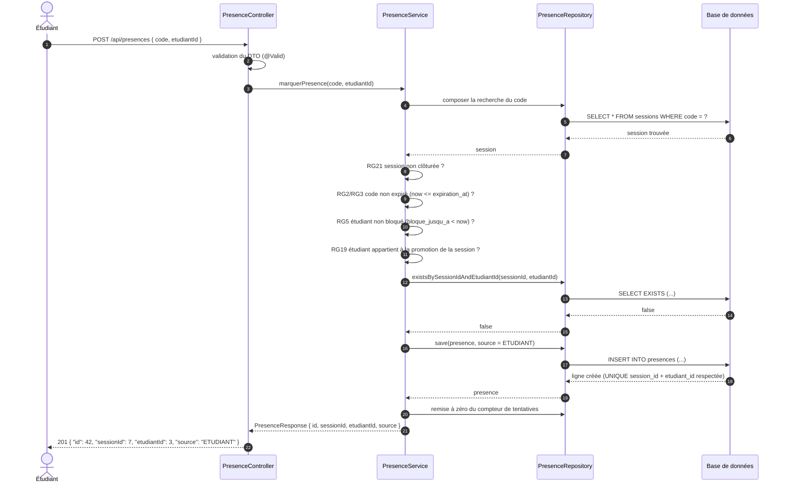
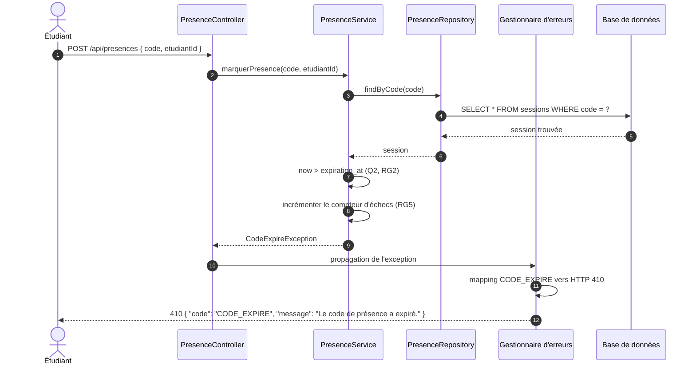
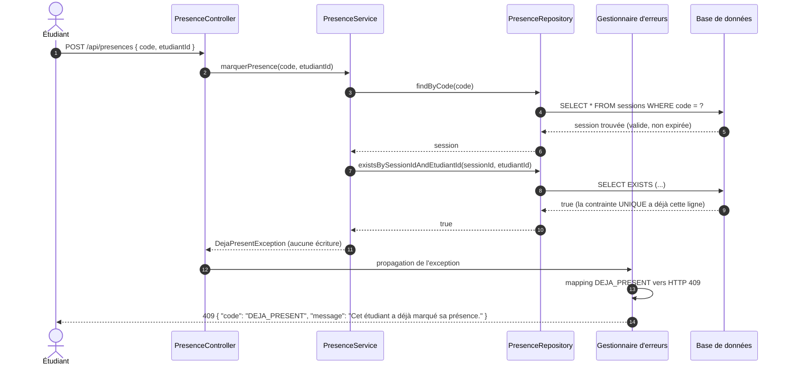

# D3 — Séquence « marquer sa présence »

**Version** : 1.0 (étape 1) · **Source** : `api/contrat.yaml`, `CLIENT.md` §3, EF2/EF3/EF13

Trois scénarios sont détaillés : le **cas nominal** (`201`), le **code expiré**
(`410 CODE_EXPIRE`) et le cas **déjà présent** (`409 DEJA_PRESENT`). Les trois se
déroulent sur l'opération imposée `POST /api/presences { code, etudiantId }`.

Conventions : `PresenceController` ne fait que valider l'entrée et déléguer ; aucune
requête base n'y figure (ENF3). `Gestionnaire d'erreurs` désigne l'unique
`@RestControllerAdvice` qui produit le format `{ "code", "message" }` (ENF4) sans jamais
exposer de stack trace.

## 1. Cas nominal — présence marquée

## 2. Code expiré — `410 CODE_EXPIRE`

## 3. Déjà présent — `409 DEJA_PRESENT`

## 4. Points de vigilance démontrés par le diagramme

| Point | Démonstration |
|---|---|
| Aucune requête base dans le contrôleur | Les appels `findByCode` / `existsBySessionIdAndEtudiantId` sont émis par `PresenceService` via `PresenceRepository` (ENF3) |
| Unicité garantie par la base | L'insertion nominale s'appuie sur la contrainte `UNIQUE (session_id, etudiant_id)`, pas seulement sur le test `exists` : un double clic concurrent ne peut pas créer deux présences (RG4) |
| Erreurs normalisées | Les trois cas sortent par le même `@RestControllerAdvice`, avec le format imposé et **aucune stack trace** (ENF4) |
| Ordre de priorité des règles | La session est chargée d'abord, puis les règles sont évaluées dans l'ordre RG21 → RG2/RG3 → RG5 → RG19 → RG4, ce qui garantit qu'un code expiré répond `410` et non `409`, conformément au contrat |
| Préparation de Q4 | Le scénario « code expiré » incrémente le compteur qui déclenche le `429 TROP_DE_TENTATIVES` au cinquième échec (RG5) |
