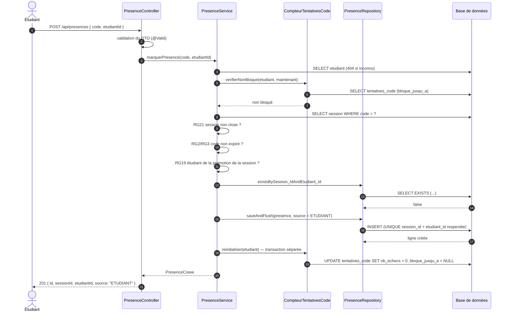
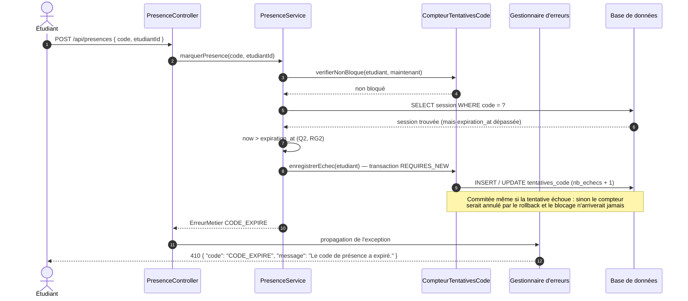
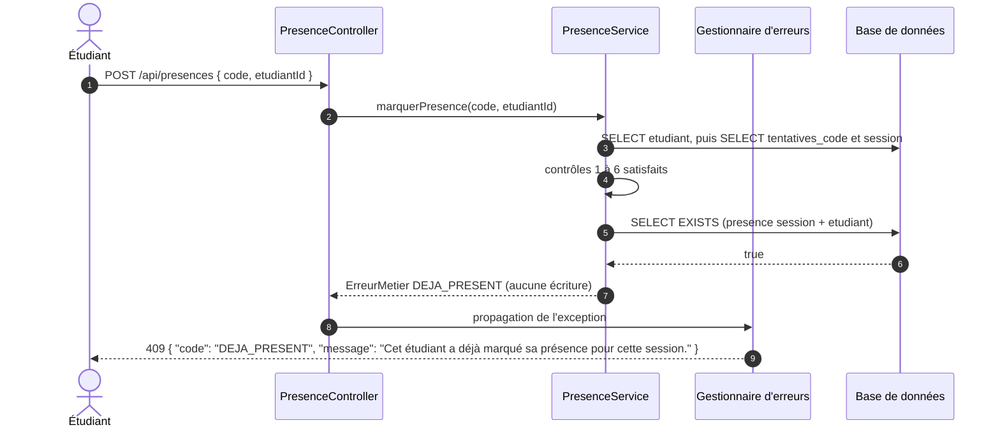
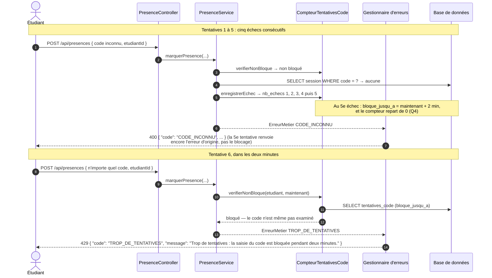

# D3 — Séquence « marquer sa présence »

**Version** : 1.1 (issue 03 et 04 livrées) · **Source** : `api/contrat.yaml`, `CLIENT.md` §3, EF2/EF3/EF13

Quatre scénarios sont détaillés : le **cas nominal** (`201`), le **code expiré**
(`410 CODE_EXPIRE`), le cas **déjà présent** (`409 DEJA_PRESENT`) et le **blocage après cinq
erreurs** (`429 TROP_DE_TENTATIVES`, ajouté par l'issue 04). Tous se déroulent sur
l'opération imposée `POST /api/presences { code, etudiantId }`.

Conventions : `PresenceController` ne fait que valider l'entrée et déléguer ; aucune requête
base n'y figure (ENF3). `Gestionnaire d'erreurs` désigne l'unique `@RestControllerAdvice` qui
produit le format `{ "code", "message" }` (ENF4) sans jamais exposer de stack trace.

**Ordre réel des contrôles** (corrigé en v1.1 : l'étudiant est chargé avant le code, sinon le
compteur de tentatives ne pourrait pas être vérifié) :

1. l'étudiant existe (`404 ETUDIANT_INCONNU`) ;
2. l'étudiant n'est pas bloqué (RG5, `429`) ;
3. le code correspond à une session (`400 CODE_INCONNU`) ;
4. la session n'est pas close (RG21, `409`) ;
5. le code n'est pas expiré (RG2/RG3, `410`) ;
6. l'étudiant appartient à la promotion de la session (RG19, `403`) ;
7. la présence n'existe pas déjà (RG4, `409`) ;
8. création de la présence, puis remise à zéro du compteur (Q4).

## 1. Cas nominal — présence marquée

## 2. Code expiré — `410 CODE_EXPIRE` (et tentative comptée)

## 3. Déjà présent — `409 DEJA_PRESENT`

## 4. Cinq erreurs puis blocage — `429 TROP_DE_TENTATIVES` (issue 04)

## 5. Points de vigilance démontrés par les diagrammes

| Point | Démonstration |
|---|---|
| Aucune requête base dans le contrôleur | Tous les accès sont émis par les services et les repositories (ENF3) |
| Unicité garantie par la base | L'insertion nominale s'appuie sur `UNIQUE (session_id, etudiant_id)` : un double envoi concurrent ne peut pas créer deux présences (RG4), la violation étant traduite en `409` |
| Expiration prioritaire sur l'unicité | L'ordre 4 → 5 → 7 garantit qu'un code mort répond `410` et jamais `409`, même pour un étudiant déjà présent |
| Compteur qui survit à l'échec | `CompteurTentativesCode` écrit dans une transaction séparée (`REQUIRES_NEW`) : sans cela, le rollback provoqué par l'exception métier effacerait l'incrément (RG5) |
| Blocage non contournable | Le contrôle du blocage précède la résolution du code : même le bon code répond `429` pendant le délai (Q4) |
| Erreurs normalisées | Les cinq cas sortent par le même `@RestControllerAdvice`, au format imposé et **sans stack trace** (ENF4) |

## 6. Ce que l'implémentation a appris (à conserver pour la soutenance)

- **L'ordre des contrôles n'est pas cosmétique** : charger l'étudiant avant de résoudre le code
  était nécessaire pour interroger le compteur de tentatives. Le passage de la v1.0 à la v1.1
  de ce diagramme correspond à cette contrainte, découverte à l'issue 04.
- **Une exception métier annule la transaction** : toute écriture qui doit survivre à un échec
  (ici, le compteur) doit être faite dans une transaction distincte. C'est le seul endroit du
  projet où `Propagation.REQUIRES_NEW` est utilisé, et c'est délibéré.
