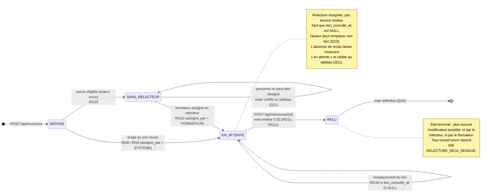

# D4 — Cycle de vie d'un exercice (bonus)

**Version** : 1.0 (étape 1) · **Source** : `docs/CAHIER_DES_CHARGES.md` (§6 RG9, RG10, RG12, RG14, RG16), D2

Diagramme bonus non exigé par la consigne, ajouté parce qu'il rend lisibles d'un coup
d'œil les trois règles les plus délicates du cahier des charges : le cas « aucun
relecteur » (§7.4), la note définitive (§7.1) et le lien figé dès la première
consultation (Q13).

## États d'un exercice

## Transitions refusées (aucun changement d'état)

Ces tentatives sont rejetées par l'API et laissent l'état inchangé : les faire figurer
explicitement évite tout état implicite non documenté.

| Tentative | Depuis | Réponse | Règle |
|---|---|---|---|
| Déposer un second exercice pour la même session | tout état | `409 EXERCICE_DEJA_DEPOSE` | contrat, D2 (unicité) |
| Déposer ou remplacer un lien après clôture de la session | tout état | `409 SESSION_CLOTUREE` | RG15, RG21 |
| Remplacer le lien après première consultation par le relecteur | `EN_ATTENTE` | `409 RELECTURE_COMMENCEE` | Q13, RG16 |
| Remplacer le lien par un tiers | tout état | `403 ACCES_REFUSE` | RG20, T9 |
| Assigner l'auteur comme relecteur | `SANS_RELECTEUR` | `403 AUTO_EVALUATION_INTERDITE` | Q5, RG6 |
| Envoyer une seconde note | `RELU` | `409 RELECTURE_DEJA_RENDUE` | Q15, RG12 (§7.1) |
| Rendre une note hors 0–20 ou non entière | `EN_ATTENTE` | `400 NOTE_INVALIDE` | Q9, RG11 |
| Rendre une note à la place du relecteur désigné | `EN_ATTENTE` | `403 ACCES_REFUSE` | T9 |

## Correspondance avec `exercices.statut` (D2)

| État du diagramme | Valeur en base | Statut visible dans `POST /api/exercices` |
|---|---|---|
| Déposé | `DEPOSE` | Transition interne à la transaction de dépôt, jamais renvoyée au client |
| En attente de relecture | `EN_ATTENTE` | `EN_ATTENTE` |
| Sans relecteur | `SANS_RELECTEUR` | `SANS_RELECTEUR` |
| Relu | `RELU` | État atteint par `POST /api/relectures/{id}`, pas par le dépôt |

L'état « relecture commencée » n'apparaît volontairement pas dans cette liste : il ne
s'agit pas d'un statut mais du renseignement de `relectures.lien_consulte_at` (D2 §6),
ce qui évite de multiplier les états pour une information qui n'est qu'un horodatage.
